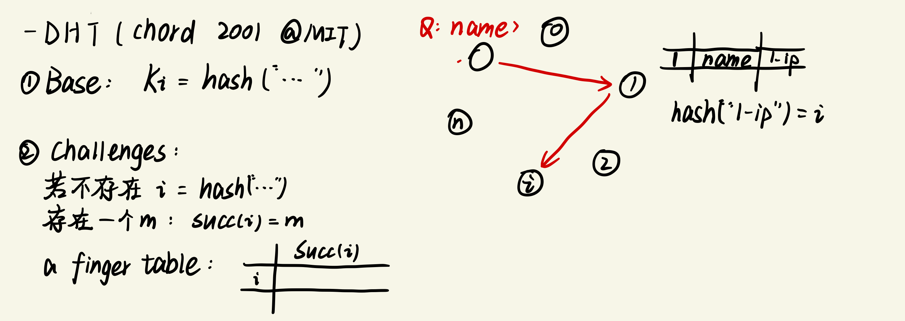

# Distributed Shared Memory

-Q: addressing (寻址问题)

-Case: DHT (哈希查找)

### Addressing

#### Message

- Packet

- Document

  Linda (Tuple)

  JINI (Java Space) - 基于内容的寻址

- “file”(page)

#### SHM

- “file”(page)
- Directory (Translation)

