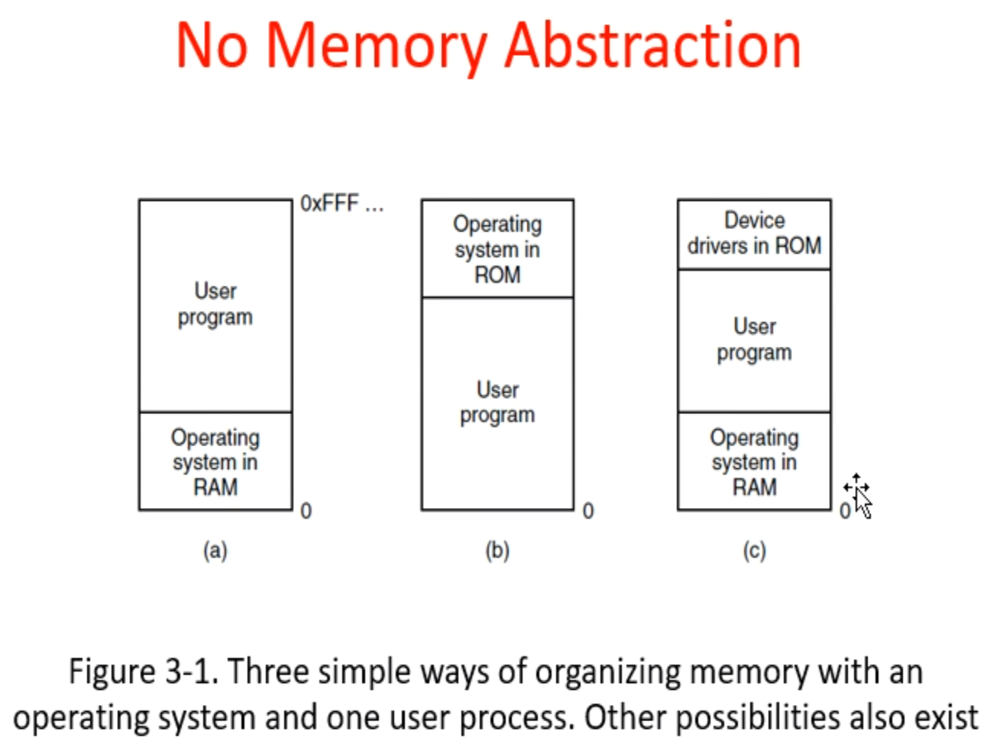
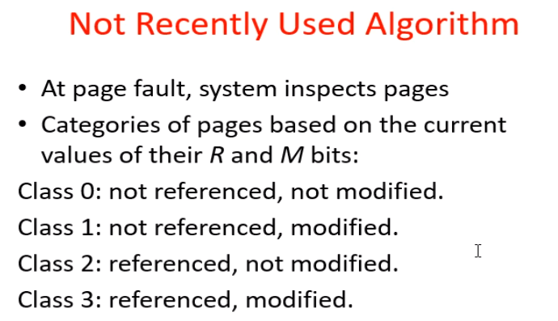
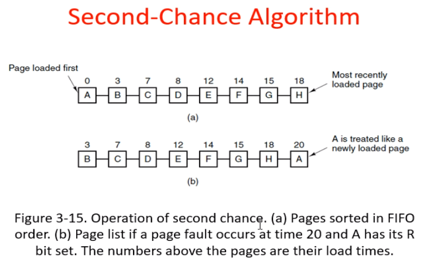
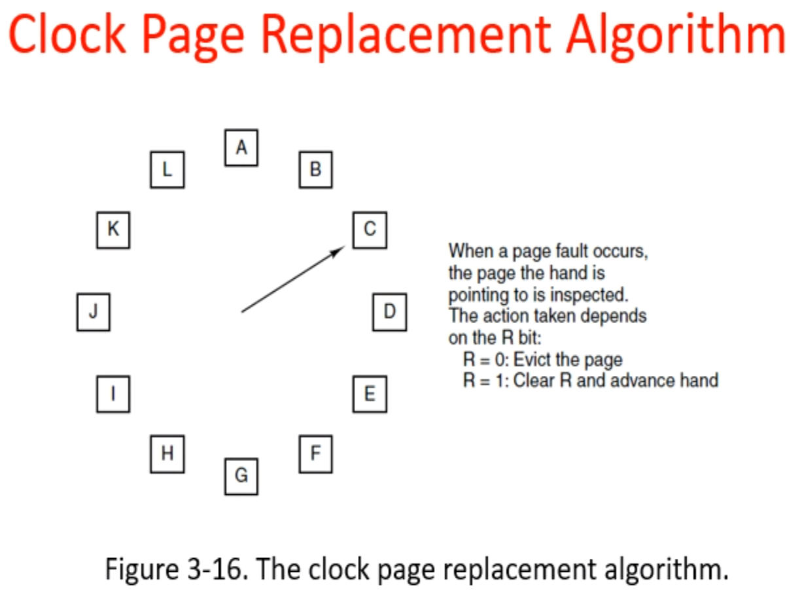
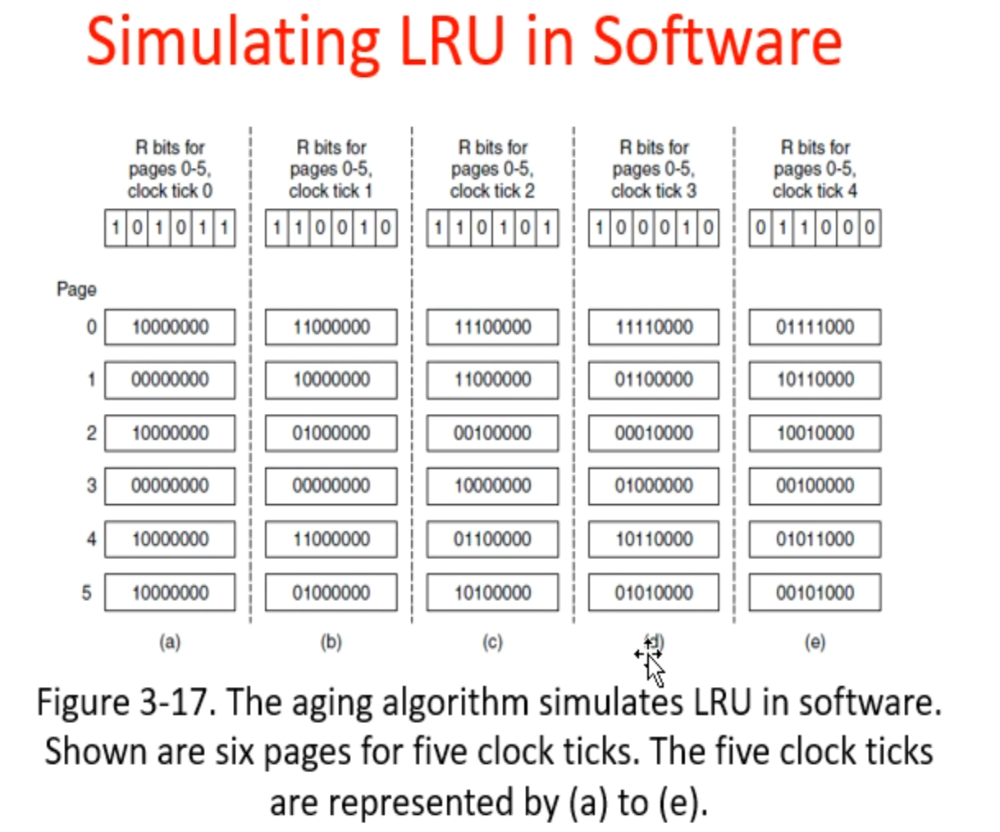

3/9

# Memory Management

**Contents**

- swap
- Overlay replacement

**Implementation**

- Phy Mem Mgnt

  - Buddy System (Unix)
  - address_space (Linux)

- Virtual Mem Mgnt

  - vm_area_struct (Process)

  - vm_struct

过一遍ppt

#### Swap

物理内存无法同时容纳多个程序的运行

swap in, swap out

#### Overlay

程序员自发进行的事

#### Replacement

**page replacement algorithm**

Optimal algorithm（最优算法；知道未来；只是理想概念）

Not recently used algorithm （两个无序集合）

First-in, first-out (FIFO) algorithn

Second-chance algorithm

Clock algorithm （Corbato@MIT）

Least recently used (LRU) algorithm (有序队列)

Working set algorithm

WSClock algorithm

