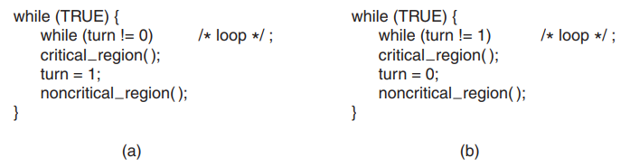
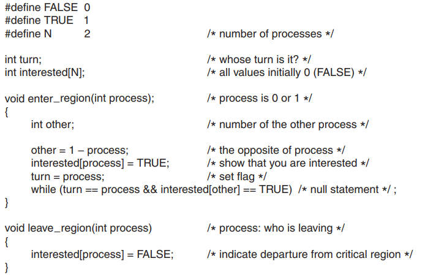
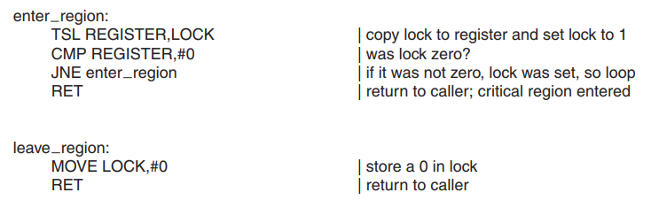

# Topic: Race Conditions
>Situations where two or more processes are reading or writing some shared data and the final result depends on who runs precisely when, are called **race conditions**.  
The part of the program where the shared memory is accessed is called the **critical region** or critical section.  
### Four conditions to hold to have a good solution:
1. No two processes may be simultaneously inside their critical regions.
2. No assumptions may be made about speeds or the number of CPUs.
3. No process running outside its critical region may block any process.
4. No process should have to wait forever to enter its critical reg
## Race Condistions Managing Strategies:
### 1. Disabling Interrupts  
>**Disableing interrupts** solution is to have each process disable all interrupts just after entering its critical region and re-enable them just before leaving it. With interrupts disabled, no clock interrupts can occur and with interrupts turned off the CPU will not be switched to another process.  

Limitations:
- dangerous
- single-processor only
- not available in user mode

### 2. Busy Waiting 
>Continuously testing a variable until some value appears is called  **busy waiting**. It should usually be avoided, since it wastes CPU time. Only when there is a reasonable expectation that the wait will be short is busy waiting used. A lock that uses busy waiting is called a **spin lock**.  
#### Examples:
1. Strict Alternation

Limitation:    
Violating condition 3 when a process hold the lock while not touching critical region and block other progress
2. Peterson's Solution

3. TSL
>TSL instruction reads the contents of the memory
word lock into register RX and then stores a nonzero value at the memory address
lock. The operations of reading the word and storing into it are guaranteed to be
indivisible—no other processor can access the memory word until the instruction is
finished. The CPU executing the TSL instruction locks the memory bus to prohibit
other CPUs from accessing memory until it is done. It is an implemetation supported by hardware.

### 3. Sleep and Wake  
>Sleep is a system call that causes the caller to block, that is, be suspended until another process wakes it up. The wakeup call has one parameter, the process to be awakened. Alternatively, both sleep and wakeup each have one parameter, a memory address used to match up sleeps with wakeups. Still, the sleep and wake can still encounter race condition as it does in the case of the Produder-Consumer promblem :

Race condition can occur because access to *count* is unconstrained. The buffer is empty and the consumer has just read count to see if it is 0. At that instant, the scheduler decides to stop running the consumer temporarily and start running the producer. The producer inserts an item in the buffer, increments count, and notices that it is now 1. Reasoning that count was just 0, and thus the consumer must be sleeping, the producer calls wakeup to wake the consumer up.  
Unfortunately, the consumer is not yet logically asleep, so the wakeup signal is
lost. When the consumer next runs, it will test the value of count it previously read,
find it to be 0, and go to sleep. Sooner or later the producer will fill up the buffer
and also go to sleep. Both will sleep forever.
