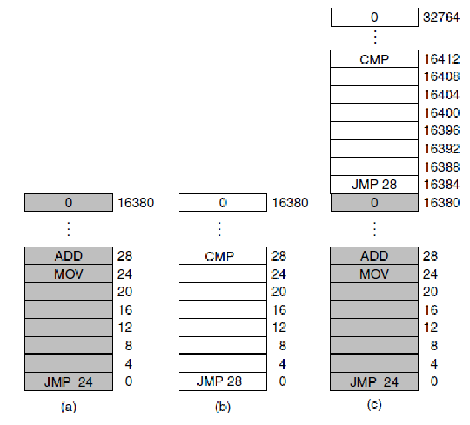
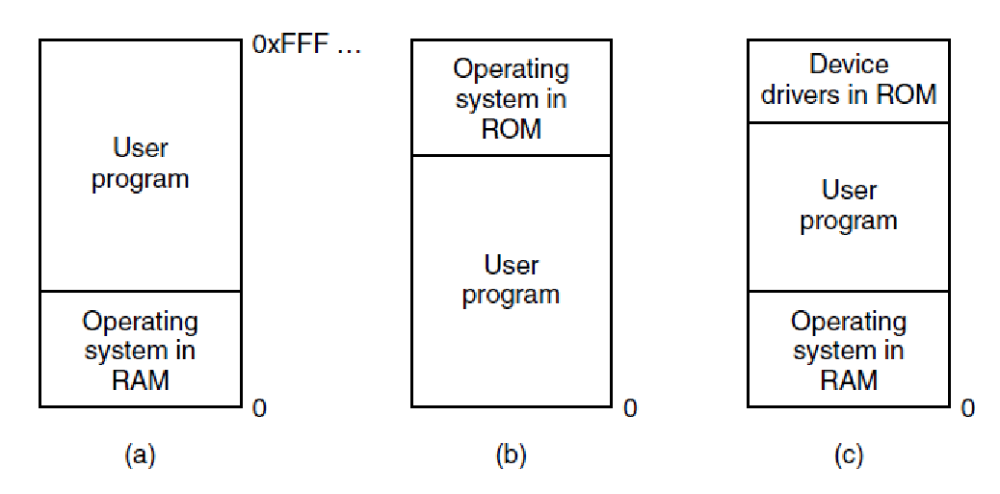
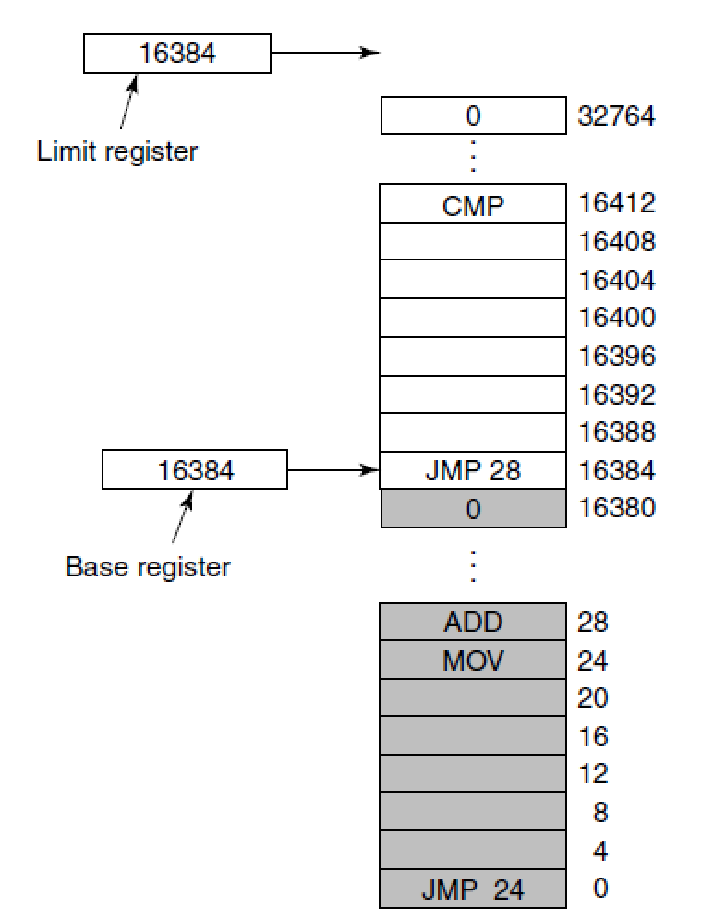
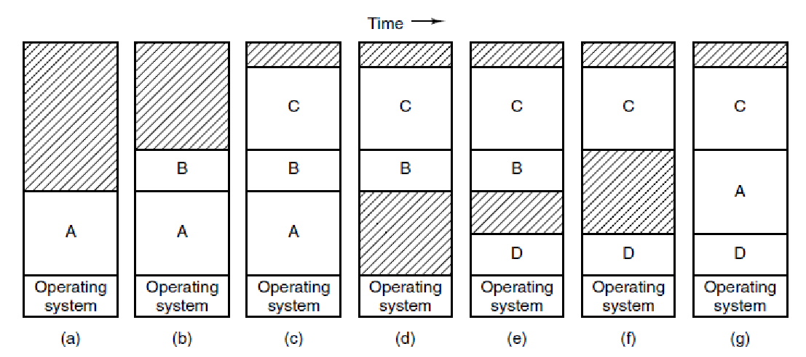
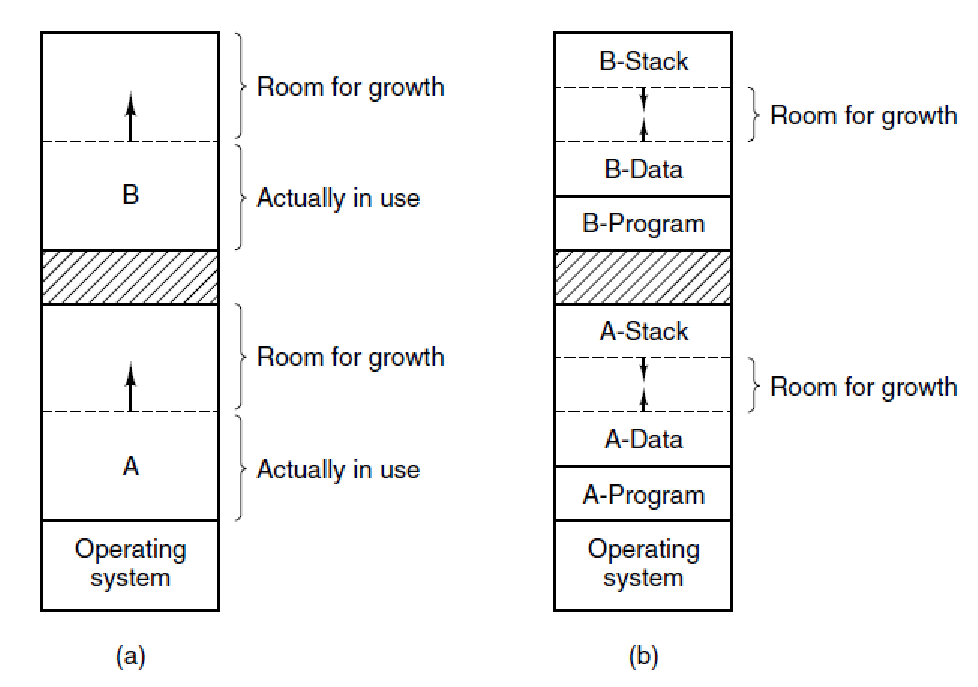

# W4D1

## review

Scheduler

- Process/Thread Sched
  - O(1) SD/RSDL, CFS
  - Unix's Sched Principle
- Higher/lower
  - User-level
  - I/O-level

Q1: Perf (system) vs. Fairness (user)

Q2: Timeslice vs. Priority

Prio = static + nice + (CPU / 2) 

## Memory Management

### topic

Process’s Memory Space vs. Kernel’s Mem Space (i.e mem_map_t)

Example: Buddy System

## Memory

### Running Multiple Programs Without a Memory Abstraction

Illustration of the relocation problem.

(a) A 16-KB program. 

(b) Another 16-KB program. 

(c) The two programs loaded consecutively into memory.

### No Memory Abstraction

Three simple ways of organizing memory with an operating system and one user process. Other possibilities also exist

### Memory Management with Bitmaps

(a) A part of memory with five processes and three holes. The tickmarks show the memory allocation units. The shaded regions (0 in the bitmap) are free. 

(b) The corresponding bitmap. 

(c) The same information as a list.

### Base and Limit Registers

Base and limit registers can be used to give each process a separate address space.

### Swapping

Memory allocation changes as processes come into memory and leave it.  The shaded regions are unused memory

(a) Allocating space for a growing data segment. 

(b) Allocating space for a growing stack and a growing data segment.

