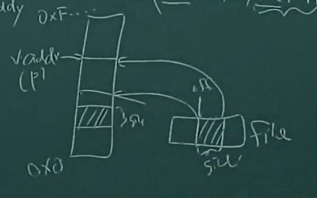
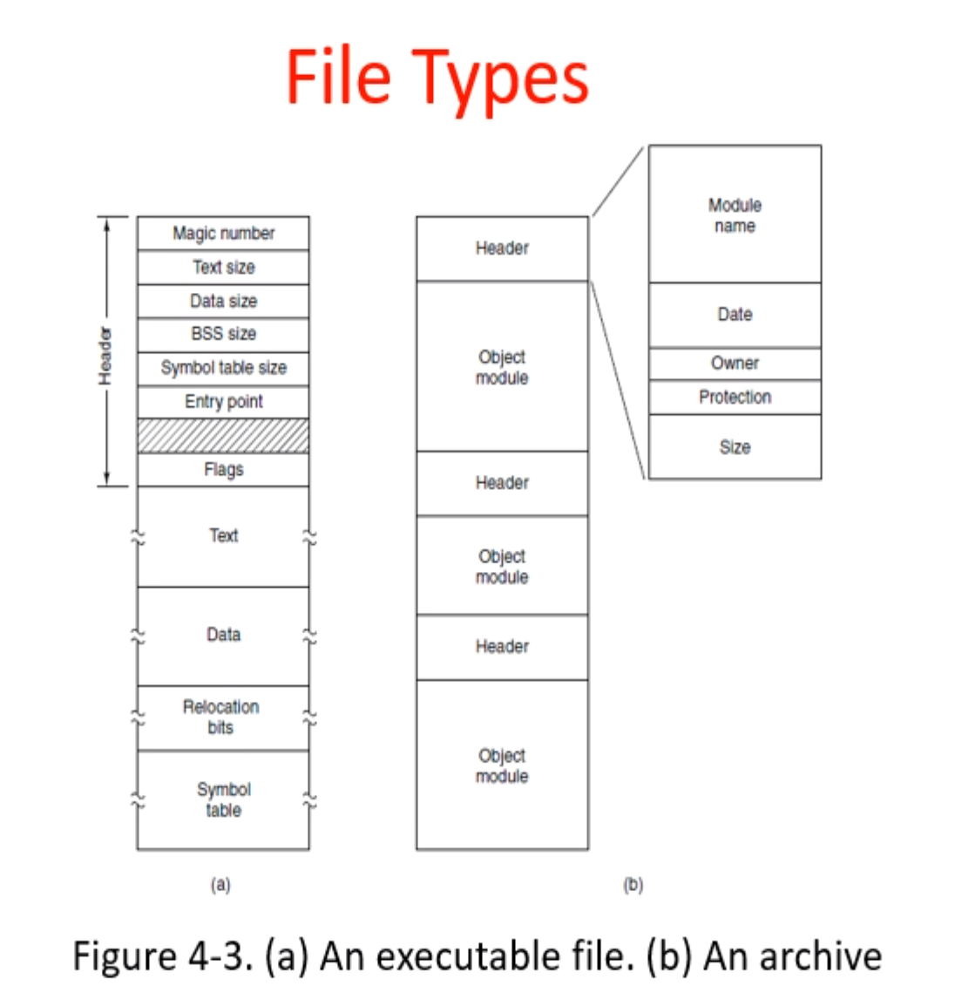
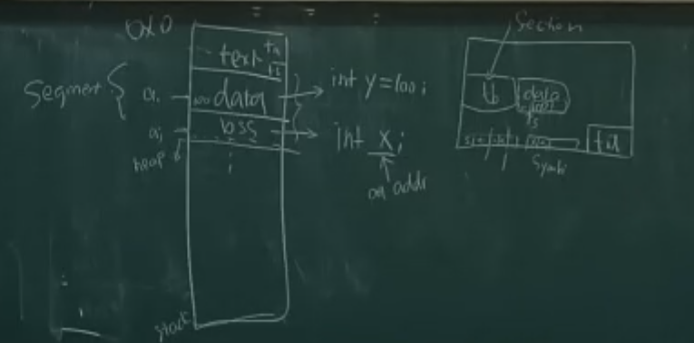
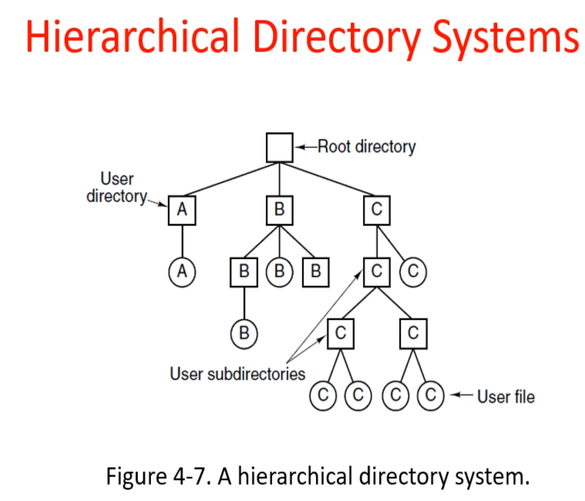

### File systems

#### Part 1 Review

- Memory Manager（Review）

  - Physical Memory ( no abstract )

  - Virtual Memory

    - Process : VM_area_struct (linear)

    - mmap ( vaddr, __ , __ , file , off , size )

      if ( vaddr = 0) anywhere

      file = fd(file back ) / file = -1 anonymous

      

    - phy : Buddy

- File = { a set of Bytes }

- FileSystem = { a set of files }

#### Part 2 Setjmp / Longjmp ( long goto )

```c++
main(){
	e = setjump(jx)
	swtich (v)...//ai
	bar();
}
bar(){
	foo();
}
foo(){
	if(something erro) long_jump (jx,value)//value tell what happens
}
```

`jx` 栈结构 记录下跳转时 `set jump` 所处的所有状态

| ai   | stack in main |
| ---- | ------------- |


#### Part 3 File System

File Systems = { a set of files }

- Insert / Delete / Searching

Question:

- How do you find information
- How do you keep one user from reading another user's data?
- How do you know which blocks are free?

magic number： D0,CF,11,E3...

**MZ：**DOS MZ executable

该文件可以通过文件开头的ASCII字符串“MZ”（十六进制：4D 5A）来识别（“幻数”）。 “MZ”是Mark Zbikowski 的缩写，Mark Zbikowski是MS-DOS的主要开发者之一。

**ELF ：**Executable and Loadable Format

ELF文件由4部分组成，分别是ELF头（ELF header）、程序头表（Program header table）、节（Section）和节头表（Section header table）。



文件中：section

内存中：segment



文件和目录都是文件



mount（挂载）：

mount 命令用于将某些设备上的文件系统附加到大文件树，加载文件系统到指定的加载点。相反，umount 命令将再次将其分离。此命令最常用于挂载cdrom，使我们可以访问cdrom中的数据

