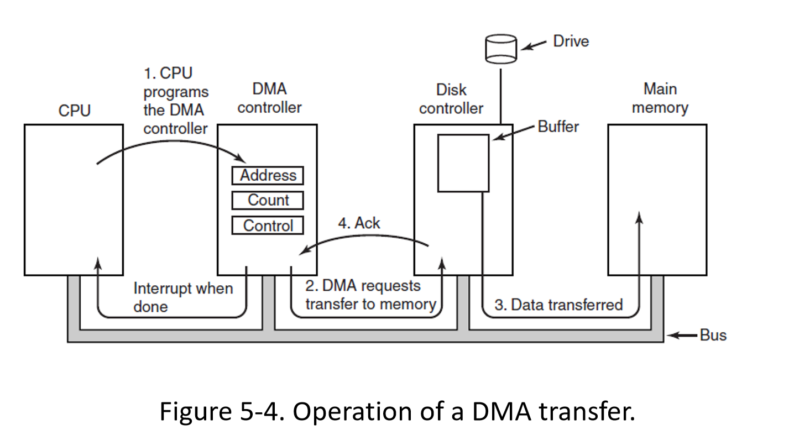

### I / O

- **Q1: How to drive an I / O (or device)** （Today's topic）
- Q2: How to Read / Write

Challenges for OS

- For reasons... DMA, Interpretation

  DMA ：全称Direct Memory Access，即直接存储器访问。

- Variety of Devices

Sequence vs Random

#### I / O devices

NFC Field

Field Bus：

- CAN：控制器局域网络（Controller Area Network）
- LONWORKS：Lonworks代表本地运营网络。

USB 本身是个网络

#### Directed Memory Access

同步方式：阻塞式

异步方式：IO 太慢了，通常采用异步，即非阻塞

低端 DMA：

DMA 发出 `add I/O` 指令，将数据存在自己的 `buffer` 里头，再发出 `add Memory` 指令，将自己 `buffer` 中的数据存入 `Main Memory`，两次总线访问。

高端 DMA：**On fly：**

DMA 发出 `add I/O` 指令，再发出 `add Memory` 指令，直接将数据传入 `Main Memory`，一次总线访问。

#### Interrupts Revisited

要先 `request` 中断线

#### Precise Interrupt

Four properties of a precise interrupt:

- The PC saved in a known place.
- All instructions before that pointed to by PC have fully executed.
- No instruction beyond that pointed to by PC has been executed.
- Execution state of instruction pointed to by PC is known.

task struct $\to$ files $\to$ file struct

- top-half
- bottom-half

DMA：

request irq  dma：使用 request_irq () 函数来注册中断服务函数

register block (or char)

H / W（HardWare）

Ref：LDD（Linux Device Driver）

#### Goals of the I/O Software

Issues:

- Device independence
- Uniform naming
- Error handling
- Synchronous versus asynchronous
- Buffering.