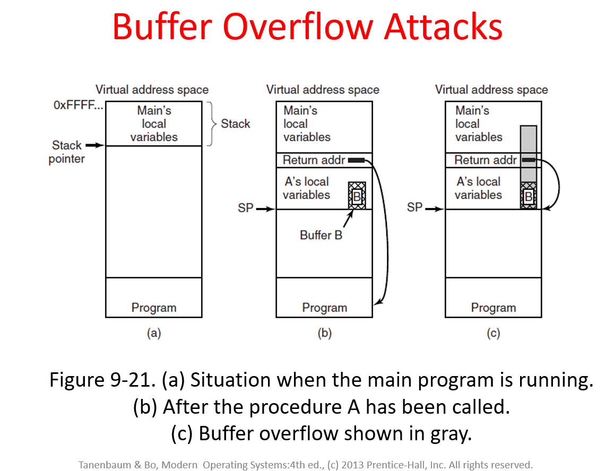
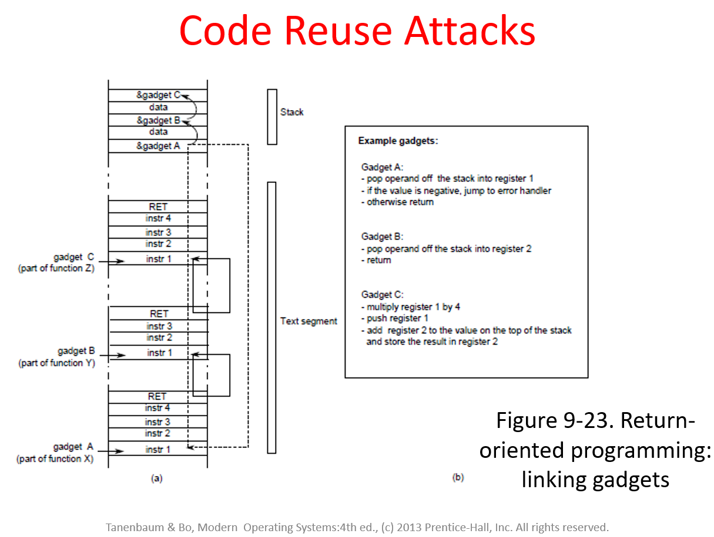
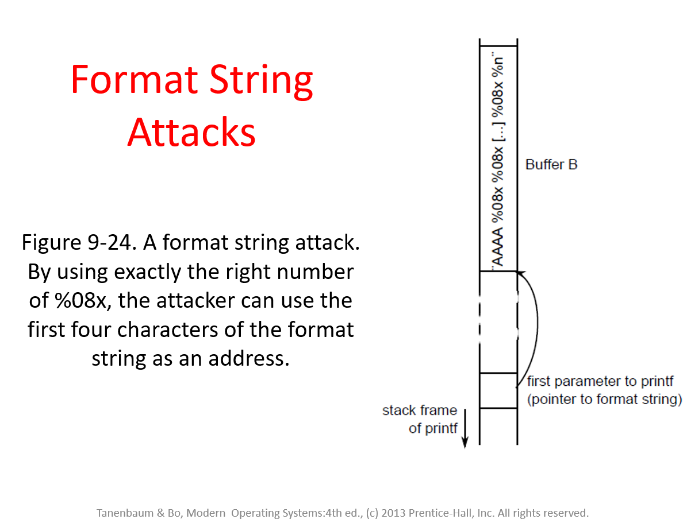

### Security

#### Buffer Overflow Attacks

The attack is able to bypass the canary and modify the return address directly.

#### Code Reuse Attacks

#### Format String Attacks

If not enough args provided, compiler will reserve space for these args. These can be used to either leak information or modify registers.

